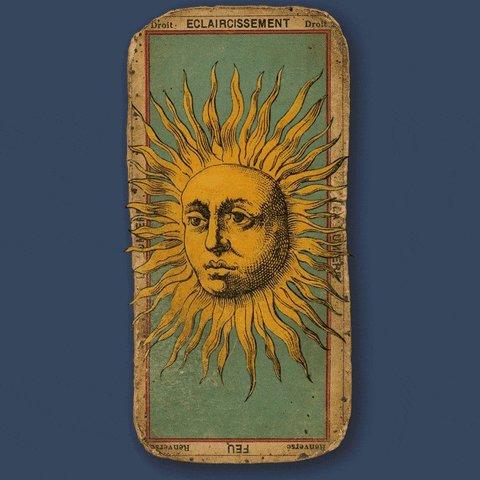

<head>
<body>
<link rel="apple-touch-icon" sizes="180x180" href="/apple-touch-icon.png">
<link rel="icon" type="image/png" sizes="32x32" href="/favicon-32x32.png">
<link rel="icon" type="image/png" sizes="16x16" href="/favicon-16x16.png">
<link rel="manifest" href="/site.webmanifest">
<link rel="mask-icon" href="/safari-pinned-tab.svg" color="#5bbad5">
<meta name="msapplication-TileColor" content="#da532c">
<meta name="theme-color" content="#ffffff">
</head>
</body>
<body bgcolor="#8D2828"> </body>
<html>

<h1> Meu hobby favorito </h1>
<meta charset="utf-8">
<h2>ESCOLA: Centro de ensino médio integrado do Cruzeiro</h2>
<h3>Profs:André e Fabiano</h3>
<h4>Aluna:Mirelly de Souza Rodrigues</h4>
<h5>Turma:2°B</h5>
<h6>Curso: TI </h6>

  Meu hobby favorito é ler cartas de Tarot.
  Antes da pandemia eu não tinha tanta sabedoria na área da espiritualidade, mas no inicio da pandemia me vi  isolada  tendo q reinventar o meu mundo  com novos desafios a serem seguidos,tanto no campo material  como no espiritual.
  A pandemia trouxe várias dificuldades, pois a sociedade teve que se manter isolada utilizando meios virtuais para quase tudo. Tudo mudou comércios,templos religiosos,esporte  e lazer.
  Umas das minhas maiores  dificuldades foi ter que continuar com o meu desenvolvimento  mediúnico sozinha,pois a taromancia é complicada. 

<table border=1>
<tbody><tr>
<th>Number
</th>
<th>Name
</th></tr>
<tr>
<td>0
</td>
<td>O Louco
</td></tr>
<tr>
<td>1
</td>
<td> O Mago
</td></tr>
<tr>
<td>2
</td>
<td>A Sarcedotisa
</td></tr>
<tr>
<td>3
</td>
<td>A Imperatriz
</td></tr>
<tr>
<td>4
</td>
<td>O Imperador
</td></tr>
<tr>
<td>5
</td>
<td>O Papa
</td></tr>
<tr>
<td>6
</td>
<td>Os Enamorados
</td></tr>
<tr>
<td>7
</td>
<td>A Carruagem
</td></tr>
<tr>
<td>8
</td>
<td>A Justiça
</td></tr>
<tr>
<td>9
</td>
<td>O Eremita
</td></tr>
<tr>
<td>10
</td>
<td>Roda da Fortuna
</td></tr>
<tr>
<td>11
</td>
<td>A Força
</td></tr>
<tr>
<td>12
</td>
<td>O Enforcado
</td></tr>
<tr>
<td>13
</td>
<td>Morte
</td></tr>
<tr>
<td>14
</td>
<td>A Temperança
</td></tr>
<tr>
<td>15
</td>
<td>O Diabo
</td></tr>
<tr>
<td>16
</td>
<td>A Torre
</td></tr>
<tr>
<td>17
</td>
<td>A Estrela
</td></tr>
<tr>
<td>18
</td>
<td>A Lua
</td></tr>
<tr>
<td>19
</td>
<td>O Sol
</td></tr>
<tr>
<td>20
</td>
<td>O Julgamento
</td></tr>
<tr>
<td>21
</td>
<td>O Mundo
</td></tr></tbody></table>

</style>

<body>

<object width="425" height="350">
<param name="movie" value="https://www.youtube.com/embed/jC13GfFo2Qs" />
<embed src="https://www.youtube.com/embed/jC13GfFo2Qs" type="application/x-shockwave-flash" width="425" height="350" />
</object>

</body>

<EMBED SRC="https://tutorialehtml.com/assets_tutorials/media/Loreena_Mckennitt_Snow_56bit.mp3" AUTOSTART= LOOP="TRUE">

    </ul>
  

<html>
  
  
